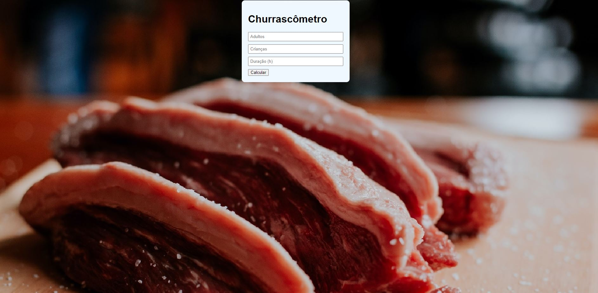

# Churrascômetro




* Carne - 400gramas por pessoa + 6horas - 650
* Cerveja - 1200ml por pessoa + 6horas - 2000ml
* Refrigerante/água - 1000ml por pessoa + 6horas 1500ml

* Crianças valem 0,5


## 💻 Pré-requisitos

Antes de começar, verifique se você atendeu aos seguintes requisitos:
* Você instalou a versão mais recente de `NODE`


## ☕ Usando <churrascômetro>

Para usar <churrascômetro>, siga estas etapas:

```
NPM START
```


